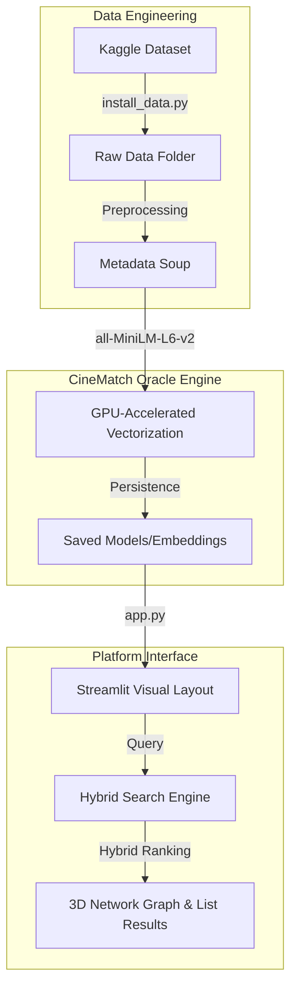

# 🎬 CineMatch 2.0: The Cinematic Oracle
<ctrl94>thought
I'll write the full content now.<ctrl95># 🎬 CineMatch 2.0: The Cinematic Oracle

> **ITCS227: Introduction to Data Science & Artificial Intelligence**
> A production-grade movie discovery platform featuring GPU-accelerated semantic search, 3D cinematic mapping, and complex hybrid recommendation logic.


CineMatch 2.0 is an advanced discovery engine that transcends simple keyword matching. By utilizing high-dimensional embeddings and a custom **Hybrid Scoring Engine**, it understands the "Soul" and "Vibe" of over **436,000 movies** to deliver near-perfect recommendations.

---

## 📂 Project Architecture



---

## 🧠 The AI Core: How it Works

CineMatch 2.0 uses a specialized **Metadata Soup** (Title + Overview + Genre + Keywords + Era Tags) to create a unique "fingerprint" for every film.

### ⚡ Hybrid Scoring Engine
Unlike standard search engines, CineMatch uses a **50/50 Hybrid Score**:
1.  **Semantic Similarity (50%)**: Measured using Cosine Similarity of query embeddings against the 436k movie vectors.
2.  **Weighted Statistical Quality (50%)**: Calculated using the IMDB weighted rating formula:
    $$\text{Score} = \frac{v}{v+m}R + \frac{m}{v+m}C$$
    *(Where $v$ is votes, $m$ is minimum votes, $R$ is average rating, and $C$ is the mean across all movies).*

### 🔮 Oracle Features
- **Mood Fusion Intent Parser**: Automatically detects if your query matches **Visual Styles** (Neon, Noir), **Emotional Impacts** (Heartbreaking), or **Narrative Complexity** (Twists) to adjust weights on the fly.
- **Hidden Gem Radar**: Specifically surfaces independent films with high ratings but lower vote counts to prevent "Blockbuster Bias."
- **3D discovery explorer**: An interactive Plotly map visualizing relationships between films in a 3D orbital space.

---

## 📦 Professional Setup & Launch

The project has been organized into a standardized directory structure for production reliability.

### 1. Initialize Environment
```bash
# Clone and enter
git clone https://github.com/9gatsu28nichi/Movie-Recommendation.git
cd Movie-Recommendation

# Setup virtual environment
python -m venv venv
# Windows:
.\venv\Scripts\activate
# MacOS/Linux:
source venv/bin/activate

# Install dependencies
pip install -r requirements.txt
```

### 2. High-Signal Data Installation
Our automated script hydrates the dataset directly from Kaggle into the project's logic core.
```bash
python scripts/install_data.py
```

### 3. Launch the Platform
```bash
streamlit run src/app.py
```

---

## 🚀 GPU Acceleration Setup

If the application displays **🖥️ CPU Mode** in the sidebar, or runs slowly, you need to install the CUDA-enabled version of PyTorch.

### Manual Fix (Windows/NVIDIA)
1. **Activate Environment**:
   ```powershell
   .\venv\Scripts\activate
   ```
2. **Uninstall CPU Version**:
   ```powershell
   pip uninstall torch torchvision -y
   ```
3. **Reinstall with CUDA 12.1 support**:
   ```powershell
   pip install torch torchvision --extra-index-url https://download.pytorch.org/whl/cu121
   ```

> [!NOTE]
> If you have an older NVIDIA GPU, replace `cu121` with `cu118` in the command above.

---

## 📂 Folder Structure

| Directory | Purpose |
| :--- | :--- |
| **`data/`** | Raw and processed movie datasets (.csv) |
| **`models/`** | Pre-trained embeddings and persistent AI states |
| **`src/`** | The platform source code and custom CSS styling |
| **`scripts/`** | Automation scripts for data fetching and maintenance |
| **`notebooks/`**| Technical research reports and logic validation |

---

## 🛠️ Tech Stack
- **AI/ML**: Sentence-Transformers (BERT), Scikit-Learn, PyTorch.
- **Frontend**: Streamlit, Custom Glassmorphism CSS, Plotly.
- **Analytics**: Pandas, NumPy, NLTK (WordNet Expansion).

---
*Developed by Jirathiwat Sun for ITCS227: Introduction to Data Science.*
